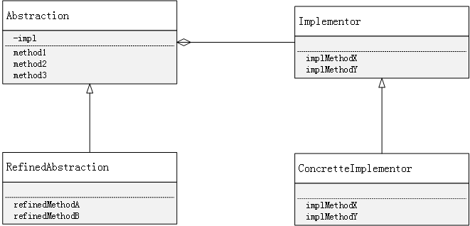

# 一、类的两种层次结构

## 1、类的功能层次结构

在希望新增加功能时，父类具有基本功能，在子类中增加新的功能，这种层次结构就被称为“**类的功能层次结构**”

## 2、类的实现层次结构

在希望增加新的实现时，父类通过声明抽象方法来定义接口，子类通过实现具体的方法来实现接口，这种层次结构就被称为“**类的实现层次结构**”

当类的层次结构只有一层时，功能层次结构与实现层次结构是混杂在一个层次结构中的。这样很容易使类的层次结构变的复杂，也南里透彻地理解类的层次结构+。因为自己也难以确定究竟应该在类的哪一个层次结构中去增加子类。因此，我们需要将“类的功能层次结构”和“类的实现层次结构”分离为两个独立的类的层次结构。这样，如果只是简单地将他们分开，两者之间必然会缺少联系。所以我们还需要再他们之间搭建一座桥梁，这种结构就是桥接模式

# 二、代码示例如下

类的功能层次结构：Display类

```java
package com.ateacer.study.designpattern.bridge;

public class Display {

    private DisplayImpl impl;

    public Display(DisplayImpl impl) {
        this.impl = impl;
    }

    public void open() {
        impl.rawOpen();
    }

    public void print() {
        impl.rawPrint();
    }

    public void close() {
        impl.rawClose();
    }

    public void display() {
        open();
        print();
        close();
    }
}
```

类的功能层次结构：CountDisplay类

```java
package com.ateacer.study.designpattern.bridge;

public class CountDisplay extends Display {

    public CountDisplay(DisplayImpl impl) {
        super(impl);
    }

    public void multiDisplay(int times) {
        open();
        for (int i = 0; i < times; i++) {
            print();
        }
        close();
    }
}
```

类的实现层次结构：DisplayIMpl类

```java
package com.ateacer.study.designpattern.bridge;

public abstract class DisplayImpl {

    public abstract void rawOpen();

    public abstract void rawPrint();

    public abstract void rawClose();
}
```

 类的实现层次结构：StringDisplayImpl类

```java
package com.ateacer.study.designpattern.bridge;

public class StringDisplayImpl extends DisplayImpl {

    private String string;

    private int width;

    public StringDisplayImpl(String string) {
        this.string = string;
        width = string.getBytes().length;
    }

    public void rawOpen() {
        printLine();
    }

    public void rawPrint() {
        System.out.println("|" + string + "|");
    }

    public void rawClose() {
        printLine();
    }

    public void printLine() {
        System.out.print("+");
        for (int i = 0; i < width; i++) {
            System.out.print("-");
        }
        System.out.println("+");
    }
}
```

客户端：BridgeTest

```java
import com.ateacer.study.designpattern.bridge.CountDisplay;
import com.ateacer.study.designpattern.bridge.Display;
import com.ateacer.study.designpattern.bridge.StringDisplayImpl;

public class BridgeTest {
    public static void main(String[] args) {
        Display d1 = new Display(new StringDisplayImpl("hello,China"));
        Display d2 = new CountDisplay((new StringDisplayImpl("hello,friend")));
        CountDisplay d3 = new CountDisplay(new StringDisplayImpl("hello,count"));

        d1.display();
        d2.display();
        d3.display();
    }
}
```

执行结果如下：

```
+-----------+
|hello,China|
+-----------+
+------------+
|hello,friend|
+------------+
+-----------+
|hello,count|
+-----------+
```

# 三、Bridge模式中的相关角色

- **Abstraction（抽象化）**

  该角色位于“类的功能层次结构”的 嘴上层，它使用Implemator角色的方法定义了基本的功能。该角色保存了Implemetor角色的实例，在上述程序中为`Display`类

- **RefinedAbstraction（改善后的抽象化）**

  在Abstraction角色的基础上增加了新功能的角色，上述程序中为`CountDisplay`类

- **Implementor（实现者）**

  该角色位于“类的实现层次结构”的最上层。它定义了用于实现Abstraction角色的接口的方法，上述程序中为`DisplayImpl`类

- **ConcreteImplementor(具体的实现者)**

  该角色负责实现在Implementor角色中定义的接口，上述程序中为`StringDisplayImpl`类

**Bridge模式的类关系图如下：**



# 四、Bridge模式的特点

- 更容易扩展

  Bridge模式的特征是将“类的功能层次结构”和“类的实现层次结构”分离开了，将类的这两个层次结构分离开有利于独立地对他们进行扩展

- 继承是强关联，委托是弱关联
