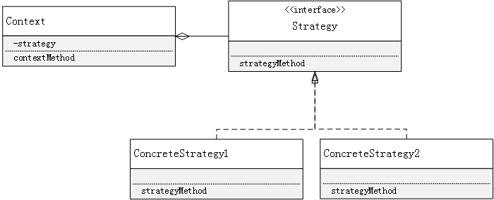

Strategy模式是一种整体的替代模式，可以让我们使用不同的算法去解决同一个问题

# 一、Strategy模式的代码示例如下

**Hand代码：**

```java
package com.ateacer.study.designpattern.strategy;

public class Hand {

    public static final int HANDVALUE_GUU = 0;

    public static final int HANDVALUE_CHO = 1;

    public static final int HANDVALUE_PAA = 2;

    public static final Hand[] hand = {new Hand(HANDVALUE_GUU), new Hand(HANDVALUE_CHO), new Hand(HANDVALUE_PAA)};

    private static final String[] name = {"石头", "剪刀", "布"};

    private int handvalue;

    public Hand(int handvalue) {
        this.handvalue = handvalue;
    }

    @org.jetbrains.annotations.Contract(pure = true)
    public static Hand getHand(int handvalue) {
        return hand[handvalue];
    }

    public boolean isStrongerThan(Hand h) {
        return fight(h) == 1;
    }

    public boolean isWeakerThan(Hand h) {
        return fight(h) == -1;
    }

    private int fight(Hand h) {
        if (this == h) {
            return 0;
        } else if ((this.handvalue + 1) % 3 == h.handvalue) {
            return 1;
        } else {
            return -1;
        }
    }

    public String toString() {
        return name[handvalue];
    }
}
```

**Strategy代码：** Strategy接口是策略的抽象

```java
package com.ateacer.study.designpattern.strategy;

public interface Strategy {

    Hand nextHand();

    void study(boolean win);
}
```

**WinningStrategy代码：** 该类是Strategy的一种具体实现

```java
package com.ateacer.study.designpattern.strategy;

import java.security.SecureRandom;
import java.util.Random;

public class WinningStrategy implements Strategy {

    private Random random;

    private boolean win = false;

    private Hand prevHand;

    public WinningStrategy(int seed) {
        random = new Random(seed);
    }

    public Hand nextHand() {
        if (!win) {
            prevHand = Hand.getHand(random.nextInt(3));
        }
        return prevHand;
    }

    public void study(boolean win) {
        this.win = win;
    }
}
```

**ProbStrategy代码：** 该类也是Strategy的一种具体实现

```java
package com.ateacer.study.designpattern.strategy;

import java.util.Random;

public class ProbStrategy implements Strategy {

    private Random random;

    private int prevHandValue = 0;

    private int currentHandValue = 0;

    private int[][] history = {
            {1, 1, 1},
            {1, 1, 1},
            {1, 1, 1}
    };

    public ProbStrategy(int seed) {
        random = new Random(seed);
    }

    public Hand nextHand() {
        int bet = random.nextInt(getSumn(currentHandValue));

        int handValue = 0;
        if (bet < history[currentHandValue][0]) {
            handValue = 0;
        } else if (bet < history[currentHandValue][0] + history[currentHandValue][1]) {
            handValue = 1;
        } else {
            handValue = 2;
        }

        prevHandValue = currentHandValue;
        currentHandValue = handValue;

        return Hand.getHand(handValue);
    }

    public void study(boolean win) {
        if (win) {
            history[prevHandValue][currentHandValue]++;
        } else {
            history[prevHandValue][(currentHandValue + 1) % 3]++;
            history[prevHandValue][(currentHandValue + 2) % 3]++;
        }
    }

    public int getSumn(int hv) {
        int sum = 0;
        for (int i = 0; i < 3; i++) {
            sum += history[hv][i];
        }

        return sum;
    }
}
```

**Player类：** 该类可以选择具体的策略

```java
package com.ateacer.study.designpattern.strategy;

public class Player {

    private String name;

    private Strategy strategy;

    private int wincount;

    private int losecount;

    private int gamecont;

    public Player(String name, Strategy strategy) {
        this.name = name;
        this.strategy = strategy;
    }

    public Hand nextHand() {
        return strategy.nextHand();
    }

    public void win() {
        strategy.study(true);
        wincount++;
        gamecont++;
    }

    public void lose() {
        strategy.study(false);
        losecount++;
        gamecont++;
    }

    public void even() {
        gamecont++;
    }

    @Override
    public String toString() {
        return "Player{" +
                "name='" + name + '\'' +
                ", strategy=" + strategy +
                ", wincount=" + wincount +
                ", losecount=" + losecount +
                ", gamecont=" + gamecont +
                '}';
    }
}
```

# 二、Strategy模式中的相关角色

- **Strategy（策略）**

  Strategy角色负责决定实现策略锁必须的接口

- **ConcreteStrategy（具体的策略）**

  ConcreteStrategy角色负责实现Strategy角色的接口，即负责实现具体的策略

- **Context（上下文）**

  负责使用Strategy角色。Context角色保存了ConcreteStrategy角色的实例，并使用ConcreteStrategy角色去实现需求

**Strategy模式的类图关系如下：**

 

# 三、Strategy模式的特点

- Strategy模式通过使用委托这种弱关联关系可以很方便地整体替换算法，也就是在不改变接口的前提下添加不同的实现
- 程序的运行中也可以动态的切换不同的策略
