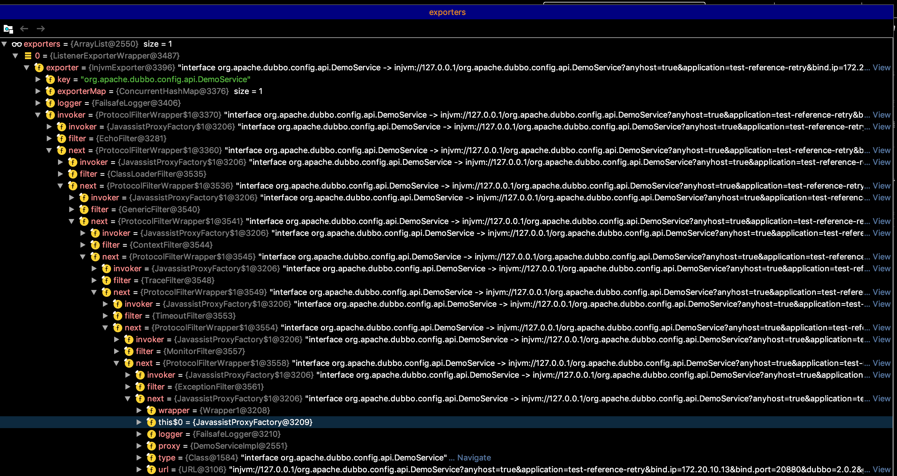

Dubbo的服务暴露分为本地暴露和远程暴露，Dubbo会首先将服务做本地暴露，然后再进行远程暴露

Dubbo最终暴露服务得到的对象是下边这个样子的：

可以看到，最外层，实际上是一个ListenerExporterWrapper对象，它的里面包了一层Exporter，Exporter里面又包了一层ProtocolFilterWrapper，ProtocolFilterWrapper的里面是一个链式结构，实际上是很多过滤器，Dubbo的服务暴露里面，包含8个过滤器，分别是：

EchoFilter、ClassLoaderFilter、GenericFilter、ContextFilter、TraceFilter、TimeoutFilter、MonitorFilter、ExceptionFilter    

在服务暴露的时候，如果没有配置`scope=remote`，则在暴露的时候，即在本地暴露，又在远程暴露，否则，只进行远程暴露，不进行本地暴露 ，如果配置了`scope=local`，则不进行远程暴露，只进行本地暴露