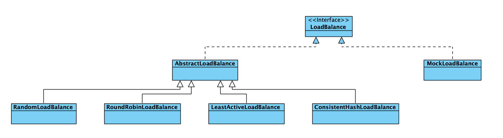
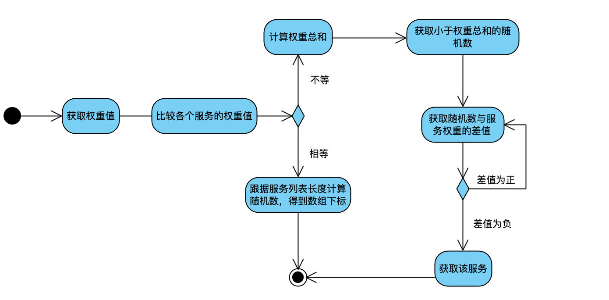
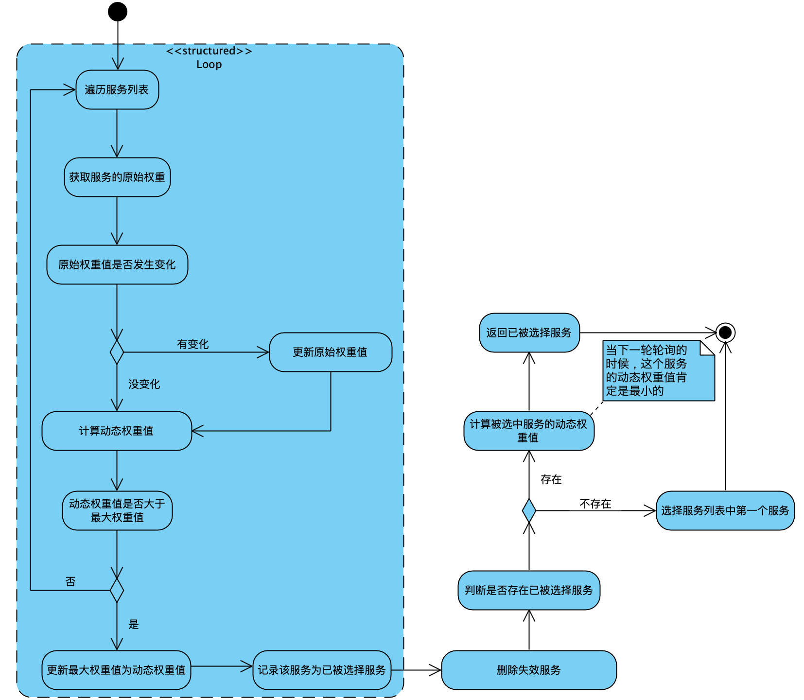
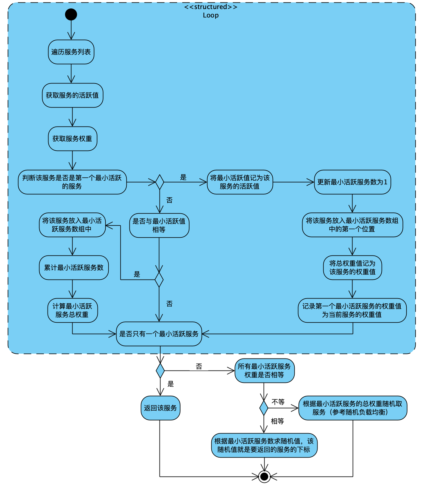

Dubbo采用软负载均衡的方式，来处理服务的分发，负载均衡也是采用插件的形式实现，Dubbo中默认的负载均衡实现方式有四种，分别是随机、轮询、最小活跃数、一致性哈希。默认采用随机负载均衡方式，如果以上四种方式不满足需求，用户也可以自己实现。

Dubbo中负载均衡的类图结构如下：



目前最新版本（2.7.x）中的`MockLoadBalance`是一个空实现，我们主要关注`AbstractLoanBalance`以及其实现类就可以

**问题：** 如果对于`FailoverClusterInvoker`，在第一次失败后，重新选择第二个可调用服务，在负载均衡中计算权重的时候，如果因为临时修改权重导致负载均衡又选择了第一次调用失败的服务，这个时候怎么办？

**答：** 在`FailoverClusterInvoker`中，如果第一次调用失败，在选择第二个可调用服务的时候，如果因为服务全中值发生变化导致又选择到第一个调用失败的服务，这个时候会触发reselect，即重新选择，其逻辑是：选择该服务所在列表索引的下一个位置的服务进行调用。实际上触发`FailoverClusterInvoker`重新选择的不止这一个因素，譬如可调用服务列表发生变化，也会进行重新选择

## 1、随机负载均衡：

Dubbo中的随机负载均衡，实际上应该叫加权随机负载均衡，Dubbo给每个可调用的服务添加了一个负载因子，通过负载因此来调整每个可调用服务的随机权重，默认情况下，每个可调用服务的权重为100，用户也可以在Dubbo控制台调整权重值

**随机负载均衡处理逻辑如下图所示：**



**描述：**

a、遍历服务列表

b、获取每个服务的权重值

c、对比每个服务的权重值，若权重值相等，则取服务总数的随机数，获取到的随机数就是最终获取到的服务在列表中的索引，若权重值不相等，则跳到步骤d

d、计算所有服务权重值的总和

e、再次遍历服务列表

f、取得d步骤计算出来的总权重值的随机数

g、计算每个服务的权重值与f计算得到的随机数的差值

h、若g计算的差值为负，则该服务就是要取得的服务，否则，回退到g步骤，直到差值为负

i、返回取得服务

## 2、轮询负载均衡

Dubbo中的轮询负载均衡策略，实际上也是加权轮询负载均衡，Dubbo根据每个服务的权重值来控制轮询的先后顺序,如果权重值相等，则从列表中的第一个元素开始轮询，如果权重值不等，则从权重值最大的元素开始轮询。Dubbo的轮询算法中有几个变量：

- **原始权重值 $ot$：**Dubbo控制台设置的初始值

- **动态权重值 $dt$：**轮询算法中动态变化的权重值，该值的计算方法：如果当前服务在该轮轮询中没有被选中，则该值在原值的基础上加原始权重值，其如果被选中了，那么这个服务的动态权重值等于原值减去总权重值，动态权重值是决定该服务最终被选择的依据，计算公式如下：

  ​							$$dt_r =\begin{cases} dt_{r-1} + ot \qquad\,,未被选中\\ dt_{r-1} + ot - st \,,被选中\end{cases}$$ 

  其中，$dt_{r-1}$ 表示上一轮轮询后的动态权重值

  动态权重值$dt$的区间范围为：

  ​                                                        $dt \leq |st| $

- **总权重值 $st$：**服务列表中所有服务的原始权重值的总，计算公式如下：

  ​							$st = \sum_{i=0}^{n-1} ot[i]$

  其中，$ot[i]$ 表示每个服务的原始权重值

- **当前最大权重值：**这个值实际上就是服务列表中最大的动态权重值

- **已被选择的服务：**最终的服务就是这个服务，实际上，这个值在轮询的过程中是发生变化的，该值是所有服务的动态权重值最大的那个服务

**轮询负载均衡的处理逻辑如下图所示：**

**描述：**

a、遍历服务列表

b、获取服务的原始权重值

c、将该服务当前的原始权重值与上一轮该服务的原始权重值做比较，如果不同，说明权重发生变化，则需要更新原始权重值

d、计算动态权重值——原始权重值+上一轮轮询后的动态权重值（如果是第一轮，该值为0）

e、比较动态权重值与最大权重值(该值的初始值为-2^63^ )，若动态权重值小于等于最大权重值，则直接跳至步骤f，否则，更新最大权重值为动态权重值，记录该服务为已被选择服务

f、将原始权重值累加

g、循环执行b-f，直至轮询完整个服务列表

h、删除失效服务：比对当前服务列表与上一次轮询后的服务列表，比对出差异服务，然后再计算差异服务最后一次活跃至当前的时间间隔，如果超过60s，则将该服务从服务列表中清除掉（注意，该服务列表是供下次轮询使用的列表）

i、如果有被选中服务，则将该服务的动态权重减去总的原始权重，这时，这个服务的动态权重肯定是服务列表中最小的，那么下次轮询时，该服务被选中的概率将最小

j、如果有被选中服务，则返回选中服务，否则，返回服务列表中的第一个元素

**为什么要将加权轮询算法做的如此复杂？**

加权轮询需要考虑几个方面：

- 在一组具有多个服务的列表中，如何保证本次被选举到的服务，在下一次轮询的过程中，不再被选到？

  Dubbo中使用了动态权重值解决了这个问题

- 如何解决轮询过程中服务列表发生变化的问题，这里也用到了动态权重值，来保证新加入的服务能够在以后的轮询过程中被选中

- 如何解决轮询过程中服务的权重发生变化的问题

实际上，Dubbo将上一轮轮询的相关参数做了缓存，在本次轮询时，会与缓存数据对比较，来解决服务列表和权重发生变化的问题

### 3、最小活跃数负载均衡

Dubbo中的最小活跃数负载均衡策略，实际上也是用到了权重的，最终如果得到多个最小活跃值相同的服务，则会走带权重的随机负载均衡策略

Dubbo中的最小活跃数负载均衡算法涉及到如下几个变量：

- 最小活跃值 $la$ 
- 最小活跃服务数 $lc$ ：具有相同最小活跃数的服务的总和
- 最小活跃服务数组 $lar$ ：具有相同最小活跃数的服务的数组
- 具有相同最小活跃素的服务的权重值总和 $lw$
- 第一个最小活跃服务 $fls$ 
- 服务的活跃值 $sa$   

**最小活跃数负载均衡的处理逻辑如下图所示：**



**描述：**

a、遍历服务列表

b、获取服务的活跃值

c、获取服务的权重

d、判断该服务是否是第一个具有最小活跃值的服务，若是，则跳至步骤e，否则，跳至步骤j

e、将最小活跃值记为该服务的活跃值

f、更新具有相同最小活跃值的服务数为1

g、将该服务放入具有相同最小活跃值的服务的数组中的第一个位置

h、将该服务的权重记为最小活跃服务的总权重

i、记录第一个最小活跃服务的权重值为当前服务的权重值（这个是在后面比较具有相同最小活跃值的服务是否具有相同的权重）

j，比较当前服务的活跃值与最小活跃值是否相等，如果相等，则跳至步骤k，如果服务列表未遍历完毕，则继续遍历下一个服务，否则，跳至步骤n

k、将该服务，放入到最小活跃服务数组中

l、累计最小活跃服务数，实际上最后数组的长度就是最小活跃服务数

m、累计最小活跃服务的总权重

n、至此，服务列表已经遍历完毕，开始操作具有相同最小活跃值的数组，若数组中只有一个元素，则该元素就是最中要返回的元素，否则，比较数组中各元素的权重是否相同，若相同，则根据数组中元素个数取随机值，该值对应的数组下标就是最中要返回元素的地址，否则，取最小活跃服务的总权重的随机值，然后根据随机值计算得到服务

### 4、一致性哈希负载均衡

Dubbo的一致性哈希负载均衡，采用了一致性哈希算法，通过在消费端的配置文件中配置hash.arguments指定对哪个方法的哪些参数进行哈希映射，具体的指定方式是指定参数索引，从0开始，若需要指定多个参数，则需要将各参数索引用逗号分隔，默认为第一个参数，即索引值为0。来决定将该请求路由到哪台服务器上

**哈希环的构造：**

Dubbo中可以通过给方法配置`hash.nodes`属性，来指定要给该服务分配多少个虚拟节点，如果没有配置，则默认分配160个节点，其构造逻辑如下：

- 首先将哈希环分为四份，这样对于该服务，每份上就对应40个虚拟节点
- 在每一份上，将该服务的地址通过MessageDigest生成md5字节数组，这个数组长度为16，然后从0～15再将每4个元素作为一组，将其生成一个哈希值，这个哈希值就是该服务的一个虚拟节点值
- 在哈希环上取服务的时候，是根据指定的参数计算得到的哈希值，来取得正其正向上大于其哈希值的第一个元素而得到最中要选中的服务

dubbo中计算哈希的算法实现如下所示：

```java
private long hash(byte[] digest, int number) {
     return (((long) (digest[3 + number * 4] & 0xFF) << 24)
          | ((long) (digest[2 + number * 4] & 0xFF) << 16)
          | ((long) (digest[1 + number * 4] & 0xFF) << 8)
          | (digest[number * 4] & 0xFF))
          & 0xFFFFFFFFL;
}
```

digest是将指定的参数拼接后通过MessageDigest生成的一个md5数组，如下：

```
[-24, 102, 35, 21, -104, -19, 76, -79, -117, -27, -28, -109, 36, 10, 17, -80]
```

**//TODO 这里需要做进一步研究** 